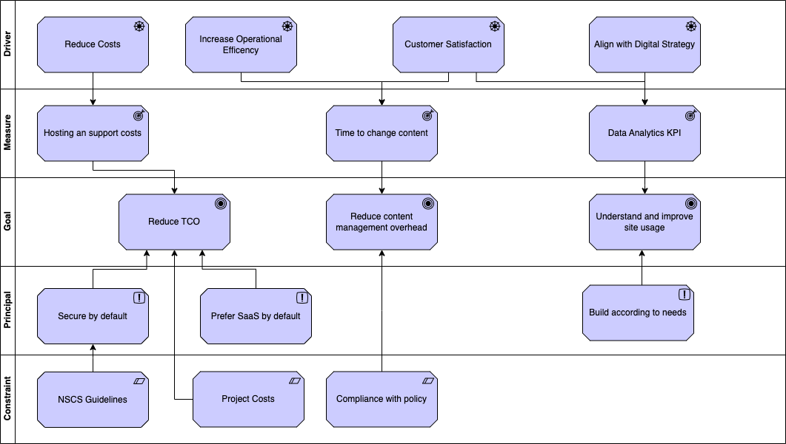

# Introduction and Goals

## Introduction

Compassion in Dying are a charity supporting end-of-life decision process. This service supports the charity by scaling the ability to product Advance Decision's and Advance Statements which can be shared with Medical and Legal professionals.

## Goals and Drivers

| Type      | Description |
|:---------:|:------------|     
| **Goal** | Reduce the total cost of ownership of the service |  
| **Goal** | Reduce the overall burden of updating content |  
| **Goal** | Provide insight and improve site usage through KPI's and Analytics |
| **Driver** | Provide a robust, stable platform that enables the creation of Advance Decision and Advance Statments |
| **Driver** | Increase operational efficiency, by reducing support calls and the completion rate of forms.|
| **Driver** | Increase customer statisfaction by providing simple to complete service. |
| **Driver** | Align with the digital strategy and ambitions to the compassion in dying organisation |

