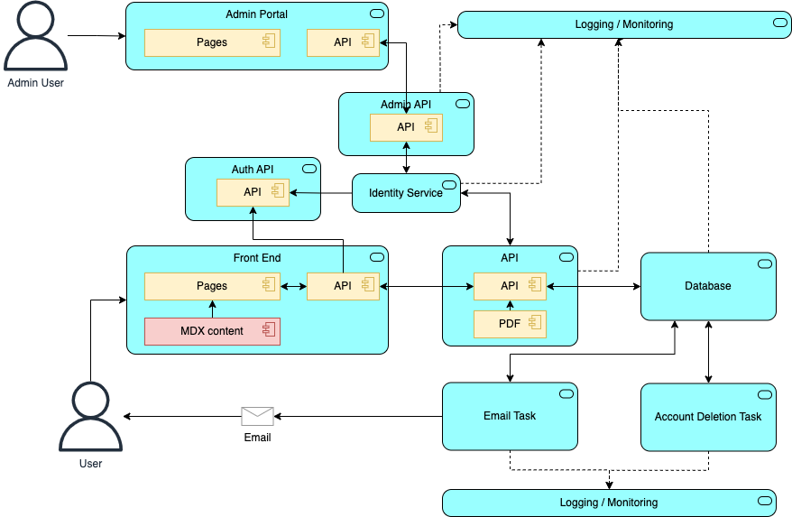

# Logical Architecture

| Component | Description |
|:---------|:-----------|
| Front End | A next JS app, with content described using the [MDX](https://mdxjs.com/) content format |
| API | Consumes requests from the front end merging the submitted JSON documents and saving to the database. The API is also responsible, for the production of the PDF's based on the data previously submitted as part of the user journey. |
| Database | The data store for the application. |
| Email Task | A task that runs periodically (by default every 10 mins) to send e-mails as required to the user |
| Account Deletion Task | A task that runs every evening (11.30pm) that checks for accounts pending deletion |
| Admin Portal | A portal to allow, the managment of user accounts and data by customer support staff |
| Admin API | An API supporting the admin portal, acting as an abstraction between the identity service and the Admin portal | 

## Cross cutting concerns 

| Component | Description |
|:---------|:-----------|
| Identity Service | Can be any OIDC/OAuth compatible service. Used for authenticating requests to the Front End and API |
| Logging and Monitoring | Logging, Alerting and monitoring for all services within the application |

