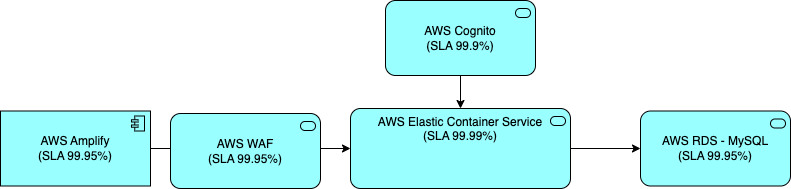

# Application Architecture

## Interaction Viewpoint 

### Component Summary 

| Component | Description |
|:---------:|:------------|
| AWS Cognito | [99.9%](https://aws.amazon.com/cognito/sla/)|
| AWS Elastic Container Service | [99.99%](https://aws.amazon.com/ecs/sla/)|
| AWS WAF | [99.95%](https://aws.amazon.com/waf/sla/)|
| AWS RDS - MySQL | [99.95%](https://aws.amazon.com/rds/sla/)|
| AWS Amplify | [99.95%](https://aws.amazon.com/amplify/sla/)|

### Availability

| Service | Availability |
|:-------:|:------------:|
| Overall SLA | 99.9% * 99.95 * 99.99% * 99.95% * 99.95% = **99.74%** |

SLA level of 99.97 % uptime/availability results in the following periods of allowed downtime/unavailability:

* **Daily**: 3m 45s
* **Weekly**: 26m 12s
* **Monthly**: 1h 53m 1.2s
* **Quarterly**: 5h 39m 3.5s
* **Yearly**: 22h 36m 14s
