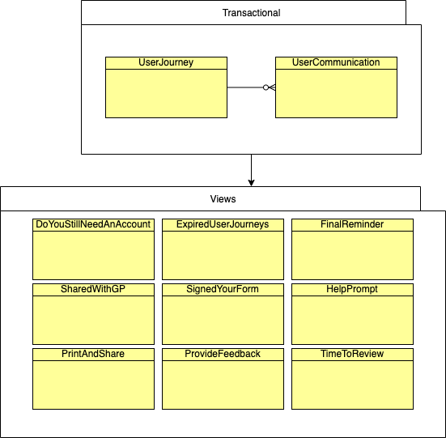
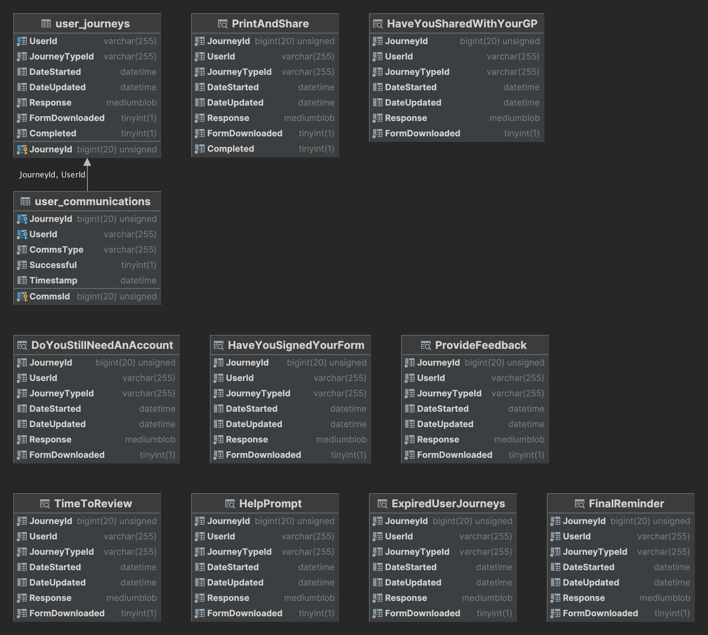

# Information Architecture

## Logical Data model

### Entities

| Entity | Scope | Repository | Description |
|:-------|:-----|:----|:------------|
| User Journey | Transactional | Choices DB | Contains a foreign key to the User ID provided by the authorisation token and the form answers presented by the front end. The Response field is build by unioning incoming response data with the previously stored response JSON document  |
| User Communication | Transaction | Choices DB | Records the emails and communications that are sent to the user as part of the scheduled email task.

### Views

| View | Description |
|:------|:-----------|
| DoYouStillNeedAnAccount | Selects users that haven't updated their account in over 8 months and haven't downloaded a form and haven't already recieved a `Do You Still need an account` e-mail. |
| HelpPrompt | Selects users that have created their account over 8 weeks ago and haven't downloaded a form and haven't already recieved a `Help Prompt` e-mail. |
| ProvideFeedback | Selects users that have created their account within the last 3 days ago and haven't already recieved a `Provide Feedback` e-mail.|
| HaveYouSignedYourForm | Selects users that have updated their account last week and haven't already recieved a `Have You Signed Your Form` e-mail.|
| FinalReminder | Selects users that haven't updated their account within the last 8.5 months and have already recieved a `Do you still need an account` e-mail, but not a `Final Reminder` email.|
| HaveYouSharedWithYourGP | Selects users that have updated their account 2 months ago and haven't already recieved a `Have You Shared with Your GP` e-mail.|
| TimeToReview | Selects users that haven't updated their account in 2 years and haven't already recieved a `TimeToReview` e-mail.|
| PrintAndShare | Selects users that have created their account within the last 10 mins and haven't already recieved a `Print and share` e-mail.|

## Data repositories 

| Name | Technologies | Description|
|:----|:------------|:-----------|
| Transactional | AWS RDS - MySQL | |

## Physical Data Architecture

