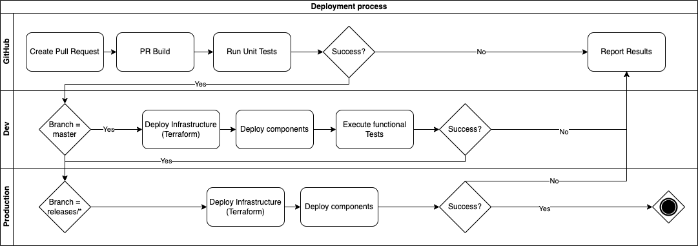

# Deployment Architecture

## Path to live model 

The current path to live model involves continuous deployment to development environment from the master/main branches dependant on the repository. Unit tests are run as part of each PR and push to master/main. If these pass then the components are deployed to the environment via Terraform.

## Logical deployment model

Deployment is managed through terraform. All services are deployed to AWS ECR images which are then deployed through AWS ECS task definitions. Images are built conditionally based on a hash of the files in the folder to be deployed. This avoids an explosion of images and utilises space in the ECR repository more efficently.
