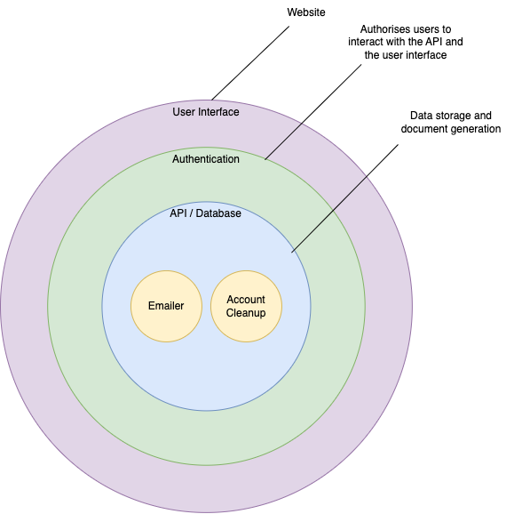

# Overview

**Vision:** To be the gold standard so that other public and private sector organisations can integrate or refer to our service rather than creating their own, allowing as many citizens as possible the opportunity to record their wishes.

**Goal:** To build a technical architecture that enables white labelling/integration of CID partners and scalability.

## What is Open Source white labelling?

A white labelled product is one that organisations can reuse whilst applying their own branding to.

In the context of the CID My Decisions journey, we offer several ways for third parties to achieve this, as they will likely need to integrate CIDs document creation with their own technical set up, and be able to apply their own branding to both the front end and the document that the service produces that captures the users decisions.

The product has been built using several layers with well defined interfaces, so if the web front end or the user storage system the CID website uses are incompatible with third parties' technical approach, they can also choose to only take on a portion of the solution.

## The current hosted solution

The current hosted solution, runs on AWS (Amazon Web Services) and is made up of 8 distintly deployable elements, 4 which make up the core service, 2 which support ancillary tasks such as sending emails and account cleanup and 2 which support customer support operations.

### Core elements

- **[Core infrastructure](https://www.github.com/Compassion-in-Dying/core_infrastructure)** - This is the baseline infrastructure repository that is used across all of the services. This repository sets up the networking, database and authentication providers used by the other elements of the service

- **[Authentication](https://www.github.com/Compassion-in-Dying/choices_auth)** - This is an authentication API that wraps the AWS cognito API to support the credentials login, password and email reset flows that are part of the hosted service.

- **[API](https://www.github.com/Compassion-in-Dying/choices_api)** - This is the primary API that the front-end application uses save/retrieve user responses and generate PDF's. This communicates directly with the database setup in the core infrastructure repository above.

- **[Front End](https://www.github.com/Compassion-in-Dying/choices_frontend)** - This is the frontend of the service, it defines the user journey, forms and styling. The API is agnositic the order the data is recieved in. So the front-end has complete control over this

### Ancillary elements

- **[Email Task](https://www.github.com/Compassion-in-Dying/email_task)** - This is a task that can be run on a periodic basis that queries the database for accounts that are are the correct points in the workflow to recieve an e-mail.

- **[Account Cleanup task](https://www.github.com/Compassion-in-Dying/account_deletion_task)** - This is a task that can be run on a periodic basis that queries the database for accounts that are are considered unused and cleans them up.

### Support elements

- **[Admin API](https://www.github.com/Compassion-in-Dying/admin_portal_api)** - An API that supports the admin portal executing various tasks that are required to support the service.

- **[Admin Front End](https://www.github.com/Compassion-in-Dying/admin_portal)** - A simple front end dashboard that supports various customer support queries and actions 

For a more detailed explination and overview [see the architecture documentation](https://github.com/Compassion-in-Dying/documentation/tree/main/architecture)

# Approach to different sized partners with differing levels of technical maturity

Potential partner organisations that are likely to integrate with the service, covers a range of technical abilities and industries, at differing levels of maturity. With this in mind we have identified 3 different partner personas:

### 1. **Small partners with limited technical maturity** 

Typically want to provide a mildy customised service for advance decisions and advance statements.

**Characteristics:**
* It is likely want to avoid technical involvement and will be content with aesthetic customisation options.
* They will likely not want to host the full solution but may be able to host the front-end code. 

### 2. **Intermediate partners with some available technical maturity** 

Want more control over the journey than small partners, for example, utilising their own e-mail templates or authentication provider.

**Characteristics:**
* It is likely want to have some control of the technical aspects
* They will likely want to host (some / all) components of the solution with some customisation.

### 3. **Large partners with a high level of available technical maturity**

Want some of the functionality above, but in a bespoke configuration that only they are likely to ever need. In this case there is the option to allow a third party access to the Compassion in Dying code repository, to allow them to take the elements they need and compile their own solution.

**Characteritics**
* Full control over the solution, hosting deployment and monitoring
* Will likely write their own front-end in a technology of their choosing and re-use some of the components,

## Modes of integration

We have identified the above candidates for integration, the table below sets out *some* of the ways a client may choose to integrate. The amount of options and ways this could actually materialise are too numerous to list exhustively but the most common methods are likely to be as follows:

| Type of integration | Description | Difficulty |
|:----------------|:------------|:-----------|
| **Direct link** | Utilises the currently hosted website, and clients simply signpost to the service | Easy |
| **[Hosting the front end code](https://github.com/Compassion-in-Dying/documentation/blob/main/white-labelling/3_Hosting.md)** | Allows the client to host the front-end code (their infrastructure and customise the style). This solution would still utilise the backend (API, Authentication and Database) hosted by compassion in dying. | Medium |   
| **[Hosting the full solution](https://github.com/Compassion-in-Dying/documentation/blob/main/white-labelling/3_Hosting.md)** | Hosting the full solution with only customisations in the front-end and re-using the API, E-Mail and Database. | Medium |
| **[Hosting selected components](https://github.com/Compassion-in-Dying/documentation/blob/main/white-labelling/3_Hosting.md)** | The client can pick and choose the components that they wish to host, to best align with their infrastructure this can be achieved by customising the code from a fork of the respository and then either deploy to an AWS account using terraform | Medium/High |
| **[Custom build](https://github.com/Compassion-in-Dying/documentation/blob/main/white-labelling/3_Hosting.md)** | The client can pick and choose the components that they wish to host, customise them at a source code level and then build and host the built docker images however they choose. | High |

More in depth details about the architecture can be found in the [architecture documentation section](https://github.com/Compassion-in-Dying/documentation/blob/main/architecture), however a high level summary is outlined in the following section

## Technical approach

We have taken a layered approach that allows different sized partners to choose which layers to use depending on their desired solution and
technical capabilities. There are 3 layers:

1.  [API / Database](https://www.github.com/Compassion-in-Dying/choices_api) - A simple API that save user responses and generates the documents, this layer encompasses the database and PDF generation.

2.  [Authentication](https://www.github.com/Compassion-in-Dying/auth_api) - An authentication layer that abstracts the details of the authentication flows from the front-end, primarily due to the credentials login requirement for the hsoted CID service. If it is the case that the partner wishes to use their own authentication pattern or a default OIDC / OAuth2 federated identity service such as Facebook, Google, Auth0, Ping etc. Then this layer is not necessary. However a different provider setting will be required. For more information on this see the dedicated Authentication section. 

3.  [User interface](https://www.github.com/Compassion-in-Dying/choices_frontend) - The front end that the users interact with.

