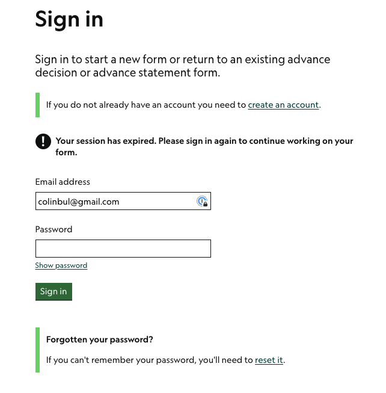
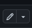
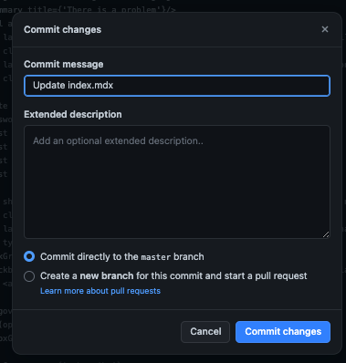
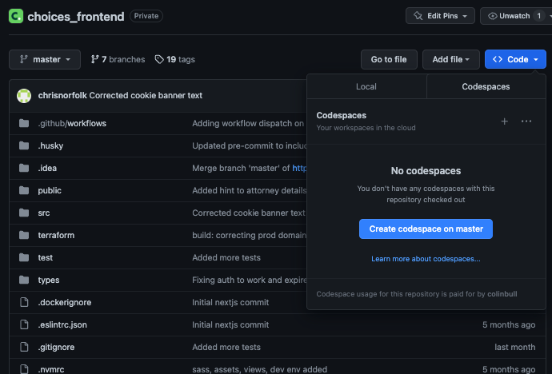
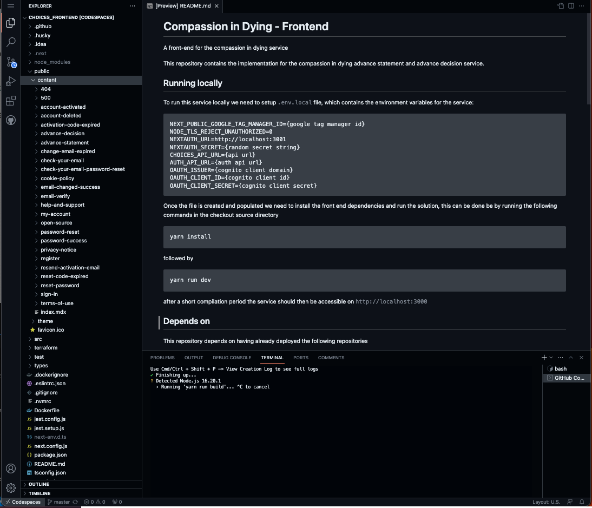
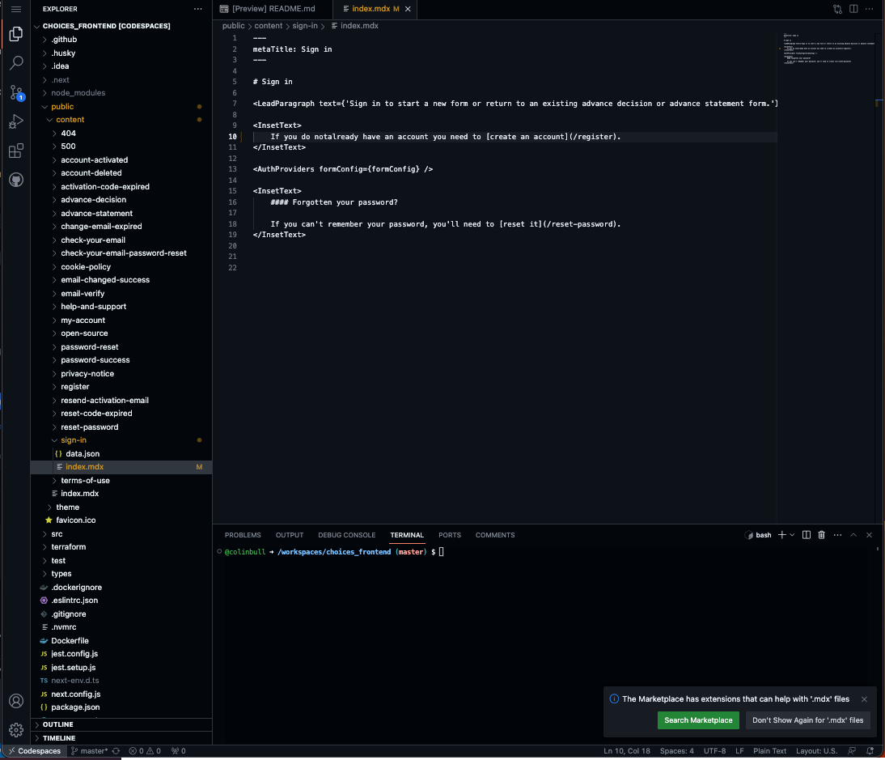
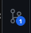
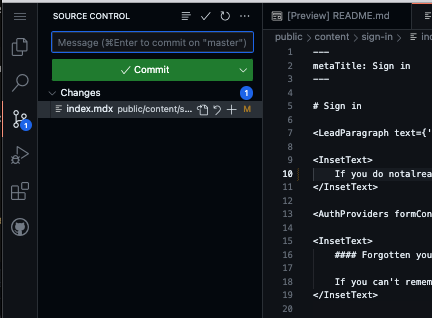
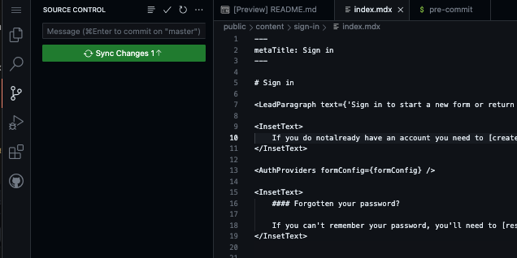

# Making Content Changes 

#### Pre-requistes

* Github account access

The front end application is built using [NextJS with an MDX extension](https://nextjs.org/docs/pages/building-your-application/configuring/mdx). This means that the content is managed using markdown files.

## What is markdown/mdx?
Markdown is a simple type setting language that allows users to control styling typography elements like headings, bullet lists, tables block quotes etc. With simple glyphs, for example, 

```
    # Heading
    ## Heading 2

    * Bullet 1
    * Bullet 2

    > This is a blockquote
```

more information on the elements and the markdown standard can be found at [https://www.markdownguide.org/](https://www.markdownguide.org/).

The compassion in dying application actually uses an extension to markdown called [MDX](https://mdxjs.com/), this allows us to embed richer elements like forms in into the pages with minimal overhead. 

For example a simple content file with a heading, some content and a Form that has 2 textboxes could be produced as follows: 

```
# My form

Please provide the details in following for to subscribe.

<Form id={'addressPage'} formConfig={formConfig}>
    <ErrorSummary title={'There is a problem.'} />
    <TextBox label={'E-mail'} name={'Email'} type={'text'} />
    <TextBox label={'Full name'} name={'name'} type={'text'} />
    <SubmitButton>Save and continue</SubmitButton>
</Form>
```

## Making content changes to the compassion in dying site

All content displayed in the service is contained within the [public folder of the choices_frontend repository](https://github.com/Compassion-in-Dying/choices_frontend/tree/master/public/content) - edits should be made in the [releases / production] branch.

Each folder in the path above represents a path in the service. For example 

https://advancedecision.service.compassionindying.org.uk/sign-in 



would map to the content file

https://github.com/Compassion-in-Dying/choices_frontend/blob/master/public/content/sign-in/index.mdx

```
# Sign in

<LeadParagraph text={'Sign in to start a new form or return to an existing advance decision or advance statement form.'}/>

<InsetText>
    If you do not already have an account you need to [create an account](/register).
</InsetText>

<AuthProviders formConfig={formConfig} />

<InsetText>
    #### Forgotten your password?

    If you can't remember your password, you'll need to [reset it](/reset-password).
</InsetText>
```

If you look at the image above and the example file content below, you should be able to see how the text corresponds.

To update the content, the process simply involves changing this file to the desired content.

### Making a change to a single file.

Once you are logged into github, navigate to the [choices_frontend repository](https://github.com/Compassion-in-Dying/choices_frontend). 

Find the file you wish to edit and click the edit icon . This will put the editor into edit mode you can then make the changes you wish to make. 

Once the changes are complete you can click the `commit changes` button and enter a message that represents the change and then click commit changes. At this point the changes will be synchronised and a build will be started.



You will notice at the bottom of the dialog that there is a radio button that has two choices. It deafults to `Commit directly to the master branch` however if you need a peer review for your change select the bottom radio button and click commit changes this will create a [Pull request](https://docs.github.com/en/pull-requests/collaborating-with-pull-requests/proposing-changes-to-your-work-with-pull-requests/about-pull-requests) that will allow others to review and comment on the changes. Once you have come to a consensus this PR can be merged.

### Making changes via the GitHub UI Codespaces. 

Once you are logged into github, navigate to the [choices_frontend repository](https://github.com/Compassion-in-Dying/choices_frontend). 

You can then open a [Github codespace](https://github.com/features/codespaces) on master by clicking on the `Create codespace on master` button see the image below.



This will open a new window, which contains an editor that will allow you edit all of the files in the repository. However you will typically only be interested in editing files in the `public/content` folder 



The editor is just a normal text editor, select the file that you wish to change from the file explorer on the left hand side and make the changes _files will be saved automatically_. When a file is changed it will be marked with a `M` next to the file name to show that there is an update to the file to be applied. 



At the moment this change isn't applied to the repository, to do this you will notice on the very left hand side of the editor that there is a icon that looks like a tree, with a number pill next to it. 

If you click on this icon it will open up the source control tab where you will see all of the files that have changed.



To apply the changes enter a commit message in the `message box` (this is required). And then click on the commit button. A dialog will pop-up with the following message: 

>There are no staged changes to commit.
>
>Would you like to stage all your changes and commit them directly?

Click `yes`. This will commit the changes and the button will change to `sync changes` 



At this point you can add more changes by repeating the steps above or you can push `sync changes` which will trigger a build and deployment.
